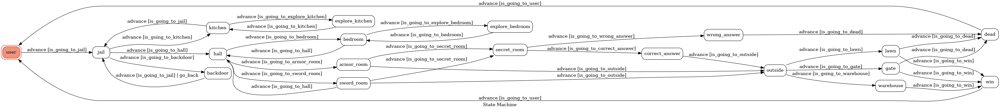
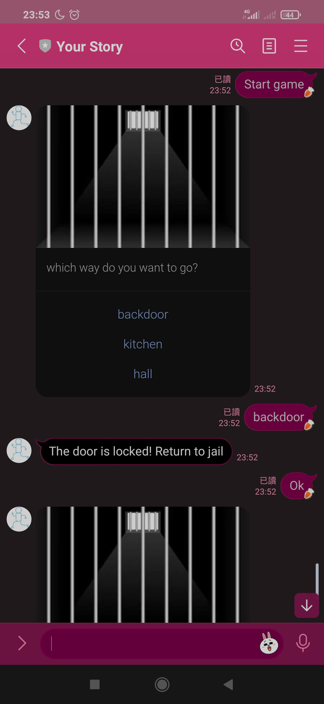
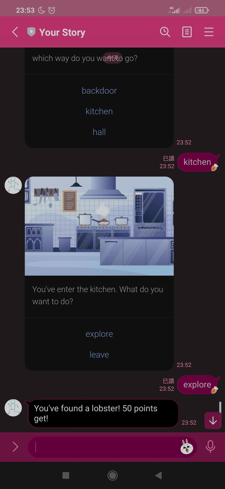
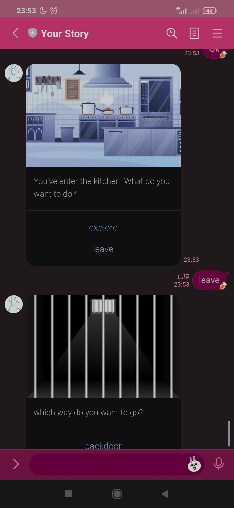
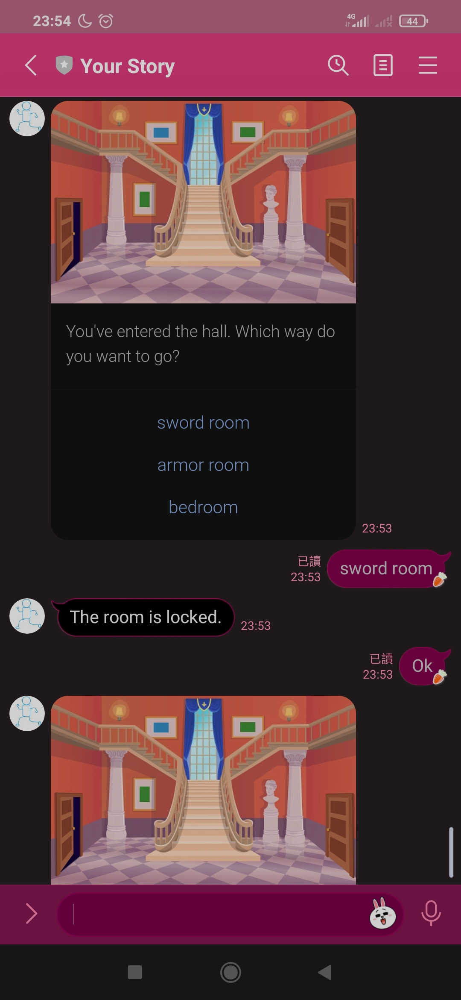
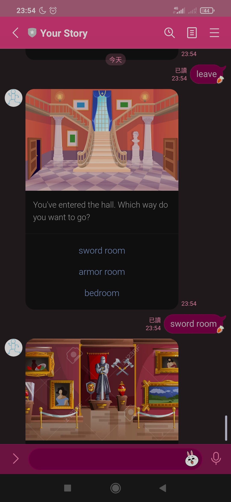
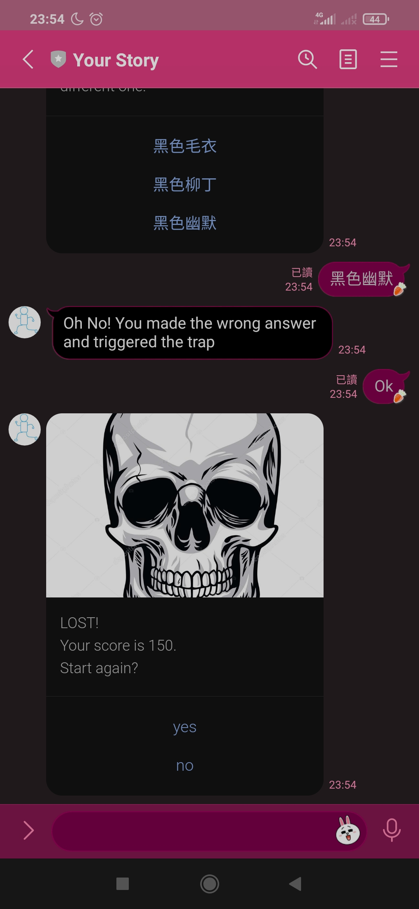

# Your Story - TOC-Project 2021

A linebot based on finite state machine which is made as an escape room game.

You woke up in a deep, dark jail. 
"Why am I here?"You thought.
If it's a dream, then it must be a nightmare.
Whatever, you have to escape this place.


## Finite State Machine


## How to Use
The initial state is set to `user`.

### States
* user 
* jail
* backdoor
* hall
* kitchen
* explore_kitchen
* sword_room
* armor_room
* bedroom
* explore_bedroom
* secret_room
* wrong_answer
* correct_answer
* outside
* lawn
* gate
* warehouse
* dead
* win

The user can type `start game` to start the game.
Then the state will be changed to `jail`.
The user can choose the direction they want to go, and may find rewards or challenges in there.

## Deploy in Heroku
Setting to deploy webhooks on Heroku.

### Heroku CLI installation

* [macOS, Windows](https://devcenter.heroku.com/articles/heroku-cli)

or you can use Homebrew (MAC)
```sh
brew tap heroku/brew && brew install heroku
```

or you can use Snap (Ubuntu 16+)
```sh
sudo snap install --classic heroku
```

### Connect to Heroku

1. Register Heroku: https://signup.heroku.com

2. Create Heroku project from website

3. CLI Login

	`heroku login`

### Upload project to Heroku

1. Add local project to Heroku project

	heroku git:remote -a {HEROKU_APP_NAME}

2. Upload project

	```
	git add .
	git commit -m "Add code"
	git push -f heroku master
	```

3. Set Environment - Line Messaging API Secret Keys

	```
	heroku config:set LINE_CHANNEL_SECRET=your_line_channel_secret
	heroku config:set LINE_CHANNEL_ACCESS_TOKEN=your_line_channel_access_token
	```

4. Your Project is now running on Heroku!

	url: `{HEROKU_APP_NAME}.herokuapp.com/callback`

	debug command: `heroku logs --tail --app {HEROKU_APP_NAME}`

5. If fail with `pygraphviz` install errors

	run commands below can solve the problems
	```
	heroku buildpacks:set heroku/python
	heroku buildpacks:add --index 1 heroku-community/apt
	```

	refference: https://hackmd.io/@ccw/B1Xw7E8kN?type=view#Q2-如何在-Heroku-使用-pygraphviz

## Images










